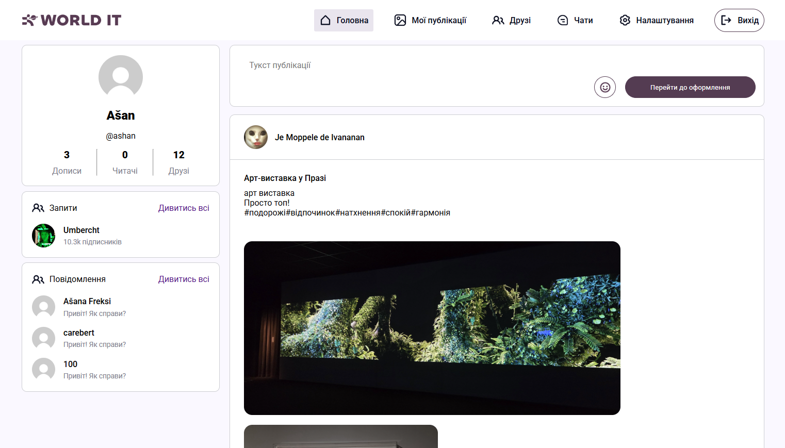
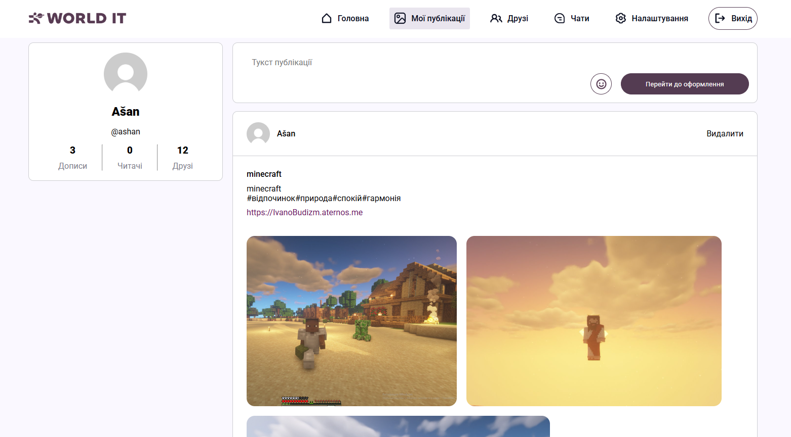
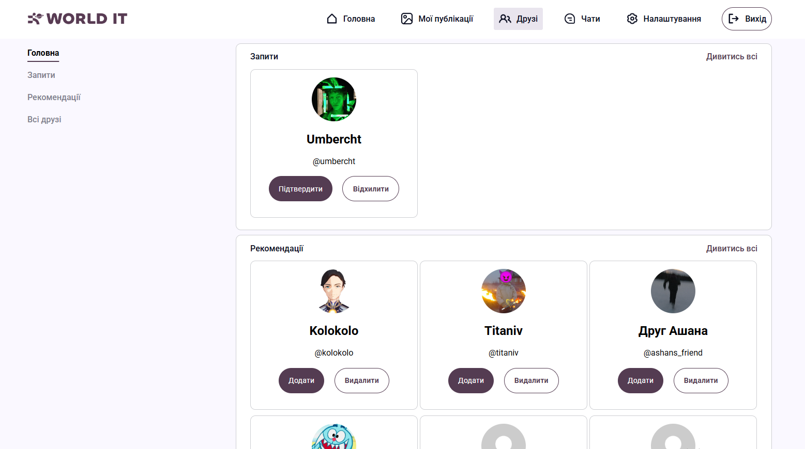
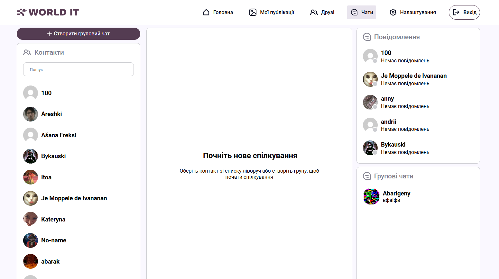

# Social Network
### соціальна мережа, розроблена на модулі Django

## 1. Мета:
- Додаток був створений та розроблений для часткового, але тим не менш важливого розуміння роботи подібних Django проектів. В додатку було створено й використано багато різних функцій для синхронної та асинхронної роботи бекенду (backend) й більшу частину роботи також займає фронтенд (frontend) та його взаємодії з вебсокетами (websockets). Як для початківців, це дуже сильний, цікавий, але і заодно тяжкий проект для початку у сфері IT та програмування.

## 2. Склад команди розробки проекту:
- Андрій Вершинін [Перейти до профілю в GitHub](https://github.com/Andrei-Vershynin)
- Аня Безпалько [Перейти до профілю в GitHub](https://github.com/Anna-Bezpalko)
- Александр Биковський [Перейти до профілю в GitHub](https://github.com/AlexanderBykovski)
- Іванов Іван (teamleader) [Перейти до профілю в GitHub](https://github.com/IvanovIvaan)

## 3. Зміст
- [Мета](#1-мета)
- [Склад команди](#2-склад-команди-розробки-проекту)
- [Модулі та технології](#4-модулі-та-технології-проекту)
- [Запуск проекту](#5-як-запустити-проект-в-роботу)
- [Зміст](#6-зміст-проекту)
- [Висновок](7-висновок)

## 4. Модулі та технології проекту
- #### Django
- #### channels
- #### daphne
- #### pillow
- #### sqlparse
- #### asgiref

## 5. Як запустити проект в роботу
- Відкрити bash terminal у проекті
- Перейти до головного файлу запуску manage.py:
    `cd Social_Network/`
- Створити віртуальне середовище venv:
    `python manage.py venv venv`
- Встановити потрібні модулі для роботи проекту:
    `pip install -r requirements.txt`
- Прописати команду запуску проекту:
    `python manage.py runserver`
- Перейти по посиланню

## 6. Зміст проекту
* ### Головні додатки:
    * #### home_app
        - додаток головної сторінки
        
    * #### post_app
        - додаток створення своїх публікацій
        
    * #### user_app
        - додаток, що відповідає за реєстрацію, авторизацію та сторінку "Друзі"
        
    * #### chat_app
        - додаток особистих й групових чатів
        
* ### Допоміжні файли:
    * #### utils
        - допоміжні функції проекту
    * #### .requirements.txt
        - список модулів, що використовуються у проекті
    * #### manage.py
        - файл запуску проекту

## 7. Висновок:
- Проект важливий для розуміння Django та інших технологій для початку та продовження розвитку мислення у сфері розробки web-додатків. Кожен додаток має свої, але здебільшого загальні функції та технології, для унікальної й водночас пов'язаної між собою роботи.

